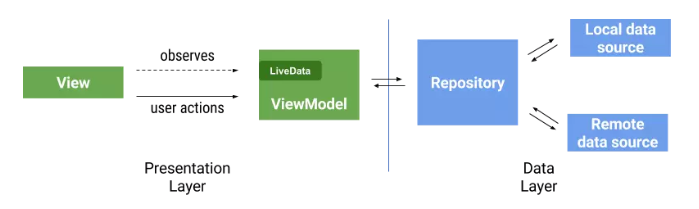
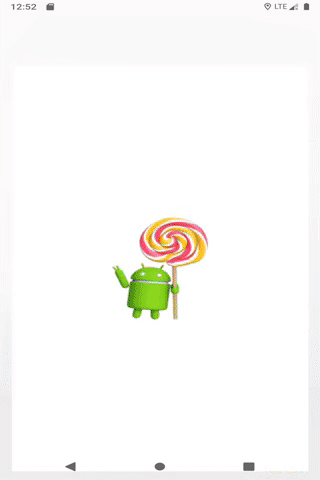

### 打造一款Material Degisn设计风格的WanAndroid，学习目前主流框架和模式并熟练应用到项目中,如果您觉得还不错的话，就点个Star吧!

#### 介绍

****

该项目采用Kotlin进行开发,遵循Material Design设计风格,使用了Google推荐的MVVM模式进行开发,使用了ViewModel+LiveData+Dagger2+Navigation+Retrofit等主流框架,旨在学习目前最主流的框架模式。

#### 预览

****

#### 框架介绍

****

- 使用Material Design设计风格,界面点击效果,ToolBar的滑动效果
- 使用Dagger2结合Dagger.Android无耦合地将Model注入ViewModel、ViewModel注入View，更高效地实现了MVVM模式。
- 使用LiveData+Retrofit进行网络请求
- 使用Navigation进行页面管理和导航,实现单Activity架构
- 使用Room操作数据库,并对网络请求做限制,设置时间内不重复请求网路
- 使用DataBinding进行数据和页面的绑定,保持干净代码
- 运用Kotlin的语言特性如属性代理,类扩展,来简化开发流程

#### 最佳实践

****

- 尽可能的精简View层(Activity/Fragment)的业务逻辑,只做更新UI的操作,将逻辑放到ViewModel中,View通过ViewModel的LiveData进行页面更新
- ViewModel不负责提供数据,将数据(网络,数据库,SharedPreference)放到Repository,ViewModel根据业务持有这些Repository的引用来获取数据
- 不要在ViewModel中持有View的引用,防止内存泄漏
- 可以在ViewModel的onCleared()中移除一些可能会导致内存泄漏的情况(如Rxjava的disposed,或移除一些监听)
- 如一些首页的数据需要共享给其他页面,可以将Repository设置成单例或者可以使用不同Fragment共享ViewModel的数据
- 使用 Data Binding 在视图和 UI 控制器之间保持干净的界面,并最大限度地减少需要在 activity 和 fragment 中编写的更新代码。
